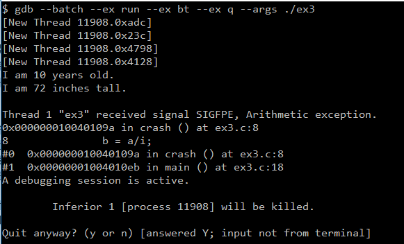
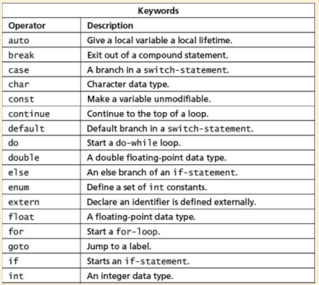

# learn_c_hard_way

这里有一个带视频和代码的网站：
https://www.safaribooksonline.com/videos/learn-c-the/9780134434452/9780134434452-LCTHW_Ex4

## gdb 使用
想用gdb看到源码，在编译的时候需使用 -g 选项

step 就是单步执行，遇到子函数就进入并且继续单步执行；在其他调试其中相当于step-into命令，作用是移动到下一个可执行的代码行。如果当前行是一个函数调用，则调试器进入函数并停止在函数体的第一行。step可以帮助初步揭开代码位置的谜团，例如：函数调用和函数本身可能在不同的文件中。

next 是在单步执行时，在函数内遇到子函数时不会进入子函数内单步执行，而是将子函数整个执行完再停止，也就是把子函数整个作为一步。在其他调试器中相当于step-over，作用是在同一个调用栈层中移动到下一个可执行的代码行。调试器不会进入函数体。如果当前行是函数的最后一行，则，next将进入下一个栈层，并在调用函数的下一行停止。

finish就是但单步执行到子函数内时，用step out就可以执行完子函数余下部分，并返回到上一层函数。在其他调试器中相当于step-out，作用是在栈中前进到到下一层，并在调用函数的下一行停止。


以下代码有一个除以0错误,测试gdb命令  
gdb --batch --ex run --ex bt --ex q --args ./ex3
``` c
int crash()
{
        int i = 0;
        int a = 1;
        int b;
        b = a/i;
        return b;
}
```


## ex5 - ex6

这里介绍了一种记忆方法,名叫 anki 卡片记忆法


记忆是必要条件，但不是充分条件，还是要多用

## ex7

16位系统：long是4字节，int是2字节
32位系统：long是4字节，int是4字节
64位系统：long是8字节，int是4字节

``` cpp
char nul_byte = '\0'; //空字符
int care_percentage = bugs*nul_byte;
printf("Which means you should care %d%%. \n",care_percentage);
```
>: Which means you should care 0%.

``` cpp
char nul_byte = '\0'; //空字符
int care_percentage = bugs*nul_byte;
printf("Which means you should care %c%%. \n",care_percentage);
```

>: Which means you should care %.

在32为系统中,long 数据类型是4个字节即32位,要讲到一个数据类型的取值范围,就应该要先了解一下原码反码和补码的概念
这篇文章讲得很通俗易懂了
https://blog.csdn.net/qq_16234613/article/details/78734222

## ex11

``` cpp
int numbers[4] = {0};
char name[4] = {'a'};
//对于int数组，只初始化了一个元素，那么剩余的会以0补全，对于char数组，只初始化了一个元素，那么剩余的会以'\0'补全
//所以
printf("name:%s",name);
//仅会输出a
```

## ex14

函数必须要声明，否则会找不到，当然定义放在前面就能找到

## ex15 指针

``` cpp
typedef struct Pixel{
        unsigned char blue;
        unsigned char green;
        unsigned char red;
        unsigned char alpha;
}Pixel;

Pixel p,*pf;
pf=&p;
//pf是结构体指针，它的值等于第一个元素blue的地址
//即pf == &(pf->blue)
//pf+1 并不是指针移动了1个字节，而是移动了sizeof(Pixel)个字节
//如果想通过移动指针访问元素green，可以这样：
unsigned char green = *((unsigned char *)pf+1);
//转换成unsigned char * 再进行指针移动
```

### 关于指针分配内存的几个容易出错的问题

1、给二级指针分配大小的时候，一定要注意指针本身的大小（32位是4,64位是8）
```
sizeof(unsigned char *)
```
2、声明指针变量的时候，不要对空指针赋值
例如：
```
unsigned char * pointer ;
*pointer = 1;
```
内存访问越界的问题很难定位的，因为c的灵活性，导致编译器不知道你现在操作的内存块是否合法的，只有在访问到不应该访问的内存块时才会崩溃。

## ex22 作用域问题

有三个文件ex22.h, ex22.c, ex22_main.c
头文件用来声明属性和方法
加extern关键字是想告诉编译器,这个字段可以在当前文件或者链接的其他文件找到
例如 B.c 文件有一个全局变量 THE_SIZE ,A.c 文件的一个函数想访问THE_SIZE,这种情况要在A.c 函数里加一个
```
extern int THE_SIZE;
```
也可以在B.h头文件里声明 
```
extern int THE_SIZE;
```
A.c 只要 include B.h就可以随意使用THE_SIZE变量了

总结:
1、在定义文件中定义全局变量, 比如A.c中定义全局变量 int a;
2、在对应的头文件A.h中声明外部变量 extern int a;
3、在引用a变量的文件中包含A.h;

#ifndef ... #define ... #endif 可以避免头文件重复包含，避免编译错误。

static关键字跟extern相反,对于c语言来说,函数是默认外部可访问的,但如果我想对外隐藏私有函数时就可以使用static 关键字修饰.
static还有一个奇葩用法就是在函数体里面修饰一个变量,首先这个变量作用域只能在该函数体,但它的数据是持久的.例如:

void increaseNum()
{
  static int num = 0;
  num++;
  printf("num:%d",num);
}
会发现num会不断自加

## ex23

达夫的设备
主要原理是缩减比较的次数,批量复制内存,改成goto后会更容易理解,唯一使我感到困惑的是为什么8,而不是其他数.

## ex24 各种io操作


``` c
//fgets遇到回车才会结束，不对空格和回车做任何转换就录入到缓冲区，结束后再往缓冲区写多一个\0，所以它是读一行数据
char buf[1024] = { 0 };
memset(buf, 0, sizeof(buf));
fgets(buf,sizeof(buf),stdin); //读取输入的一行数据到缓冲区buf里

//fscanf遇到空格或回车就结束，它会把空格或回车转换为\0，所以它是读一小段数据
char buf[1024] = {0};
memset(buf, 0, sizeof(buf));
fscanf(stdin,"%s",buf);

```
TODO:
列出 fgets fscanf 等函数的区别的应用场景

## ex25 可变参数函数

``` c
//下面是 <stdarg.h> 里面重要的几个宏定义如下：
typedef char* va_list;
void va_start ( va_list ap, prev_param ); /* ANSI version */
type va_arg ( va_list ap, type ); 
void va_end ( va_list ap ); 

//下面是自己定义的可变参数函数
int read_scan(const char * fmt,...){
  va_list argp;
  va_start(argp,fmt);//通过va_start 初始化va_list

  //读取第一个int类型的可变参数, 读完之后va_list指针会移动至下个参数
  int out_int = va_arg(argp, int);;

  //读取第一个int*类型的可变参数
  int *p_out_int = va_arg(argp, int *);

  *p_out_int = 2;

  va_end(argp);//start 和 end经常同时出现,防止内存问题
  

}
```

## ex26 

TODO

